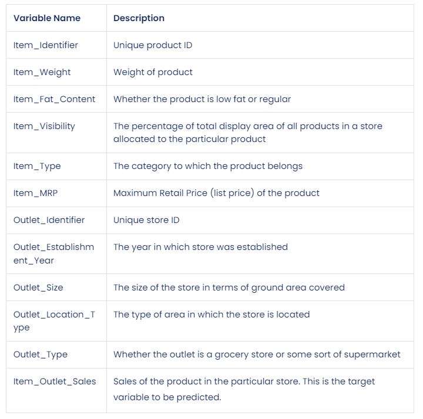
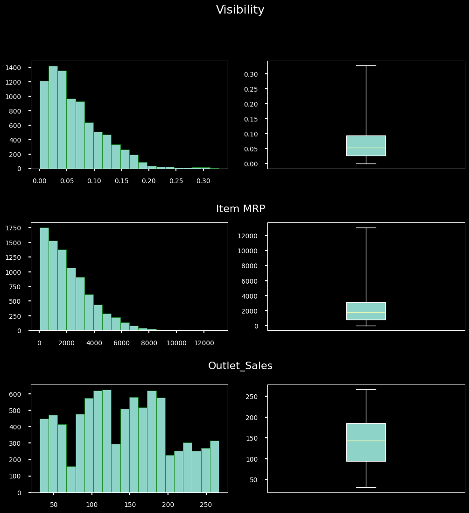

# Sales Predictions
## Sales prediction for food items sold at various stores

**Haouari Ahmed Anas**: 

### This project is a sales prediction for food items sold at various stores. The goal of this is to help the retailer understand the properties of products and outlets that play crucial roles in increasing sales.

## Data Source:
Big Mart Sales Prediction : https://datahack.analyticsvidhya.com/contest/practice-problem-big-mart-sales-iii/

For this dataset, there were 8523 rows and 12 columns.

### Data Dictionary

## To prepare this data, the data was cleaned, and the following processes were performed:

### Exploratory Data Analysis:
     - During the exploratory data analysis, a boxplot and histogram was visualized for each numeric datatype column. 
    - Also, a barplot was visualized for each categorical column. 
    - This gave a good baseline for all of the numeric and categorical columns for univariate EDA.
    
#### Data Distribution

> This figure shows distribution of the variables : Visibility, Item MRP and Outlet Sales.

### Explanatory Visuals
.png)

> This figure shows Item sales by types, by fat content, Outlet Size and Outlet Location Type.

.png)

> This figure shows the sales rates depending in the average Item MRP and we can see that the sales increase with the MRP of the product.

## Model

  - Linear Regression Model
  - Decision Tree Regressor Model
  - Tuned Decision Tree Regressor Model

- Training Set Scores:
MAE: 762.63 
MSE: 1,172,123.39 
RMSE: 1,082.65   
R2: 0.60
- Testing Set Scores:
MAE: 738.44 
MSE: 1,118,204.90 
RMSE: 1,057.45   
R2: 0.59
   
## Recommendations:

- Tuned Decision Tree Model by Max Depth (Depth = 5) was the model with best results for the testing data. But The model still perform poorly, other types of models can be explored to see how they perform.

### For further information

For any additional questions, please contact **haouari_ahmed_anas@gmail.com**
